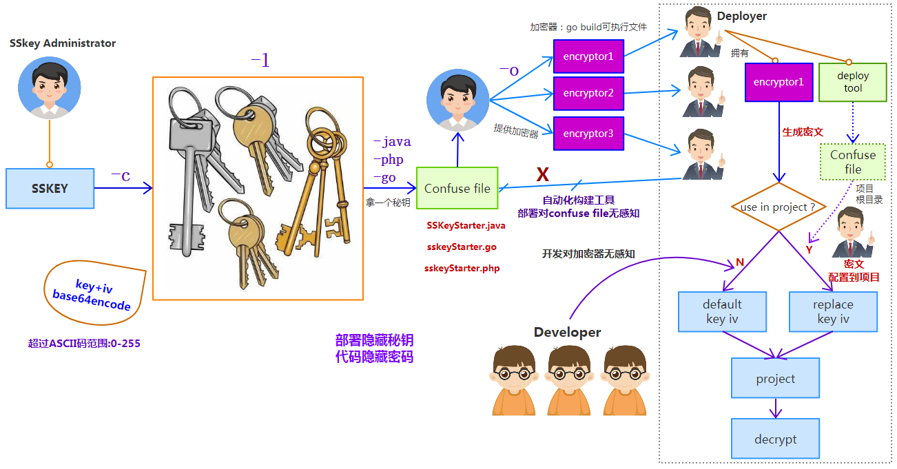

# SSKEY

基于AES的CBC模式与pkcs5UnPadding填充算法的一套加解密解决方案，内置多个秘钥(key+iv)管理功能

key的长度固定为32字节，iv的长度固定为16字节，使用base64 encode输出

## 基础语法

```shell

    sskey
        -l              		List all saved keys
        -c keyName      		Create a new key and save it
        -t keyName      		Test key
        -e [keyName] data       Encrypt data by specified key or default key
        -d [keyName] data       Decrypt data by specified key or default key
        -php keyName        	Output php code
        -java keyName       Output java code
        -go keyName         Output go code
        -o keyName          Encrypt tool(make executable file)
    Samples:
        sskey -l
        sskey -c aaa
        sskey -t aaa
        sskey -e 123456
        sskey -d vcg9B/GX3Tqf1EWfpfDeMw==
        sskey -php aaa
        sskey -java aaa
        sskey -go aaa
        sskey -o aaa
    
```

简单说明：

### 默认秘钥

未指定秘钥时，默认秘钥为：

```go
key = "?GQ$0K0GgLdO=f+~L68PLm$uhKr4'=tV"
iv = "VFs7@sK61cj^f?HZ"
```

### 列表

通过``sskey -l``可以查看本地秘钥列表:

```shell
/root/sskeys/shop
/root/sskeys/order
```

### 创建

使用 sskey -c user可以创建一个秘钥：

``/root/sskeys/user``

### 加密

使用```sskey -e user 123asdf```可以得到指定user为秘钥，密码为123asdf的密文。

使用```sskey -e 123asdf```可以得到密码为123asdf，默认秘钥的密文。

### 解密

使用```sskey -d user 密文```可以得到以user为秘钥，指定密文解密后的密码。

使用```sskey -d 密文```可以得到指定密文，默认秘钥解密后的密码。

### 秘钥生成文件

针对不同的技术栈，使用：

```shell
sskey -php user
sskey -java user
sskey -go user
```

生成指定user为秘钥的key、iv混淆生成文件（Console file），加大破解难度,应用于不同技术栈项目中

key与iv中，字符都是随机的，0-255范围内（对应二进制转为10进制整数），超出0-127Ascii码可以识别的范围

### 加密器

``sskey -o user``

可以生成包含key,iv混淆生成的main()方法go语言文件

将这个文件进行编译即生成了以user为秘钥的加密器

## SSKey流程

如下图所示：



秘钥管理员拥有sskey整体权限

- -c创建秘钥，放入本地的秘钥库 
- -l查看秘钥库中的秘钥列表
- -java -php -go 生成指定秘钥对应的混淆文件
- 将混淆文件加入到自动化构建工具中，自动化构建工具包含的逻辑不可开放（可以用go来写一个deploy），和加密器一起配合使用
- -o生成go代码编译成加密器，根据不同的秘钥分发给不同部署人员使用

- 部署人员根据加密器得到密文配置到项目，同时通过部署工具将consule file放入项目中替换默认的key与iv
- 部署成功

整体流程的使用：
加大了获取秘钥的难度，同时密码在项目中获取不到，保障了项目密码安全

开发在本地环境使用的时候，没有consule file，使用默认秘钥，对sskey的使用流程无感知，sskey的执行对开发没有影响

## 具体解决方法

项目需要拥有AES加密类或方法

同时需要自定义setSSKey方法来与consule file配合使用

### java

#### SSKeyStarter.java（工具提供）

由`sskey -java user`生成，提供key和iv给项目使用，由部署工具放入项目根目录

#### SSKeySetter.java（自定义实现）

放在项目根目录，类固定为SSKeySetter，实现方法固定为public void set(byte[] key, byte[] iv)，方法实现由项目自定义秘钥设置

类似：

```java
public class SSKeySetter {
    public static boolean inited = false;
    public static void set(byte[] key, byte[] iv){
        if(inited) {
            return;
        }
        inited = true;
        AesUtil.setKeys(key, iv);
    }
}
```

#### Aes加解密类

Aes加解密使用："AES/CBC/PKCS5Padding"

为了调用SSKeyStarter，其中需要包含类似：

```java
static {
    try{
        Class c = Class.forName("SSKeyStarter");
        Method m = c.getMethod("init");
        m.invoke(null);
    }catch (Exception e) {

    }
}
```

具体解密类似：

```java
public static String decrypt(final String encryptedStr){
        if(encryptedStr == null){
            return null;
        }
        //密码
        final SecretKeySpec keySpec = new SecretKeySpec(key,"AES");
        //初始化向量器
        final IvParameterSpec ivParameterSpec = new IvParameterSpec(iv);
        try {
            Cipher encipher = Cipher.getInstance(TRANSFORM_CBC_PKCS5);
            //加密模式
            encipher.init(Cipher.DECRYPT_MODE, keySpec, ivParameterSpec);
            //先用BASE64解密
            byte[] encryptedBytes = Base64.decodeBase64(encryptedStr);
            //然后再AES解密
            byte[] originalBytes = encipher.doFinal(encryptedBytes);
            //返回字符串
            return new String(originalBytes);
        } catch (Exception e) {
            System.out.println("基于CBC工作模式的AES解密失败");
            e.printStackTrace();
        }
        return null;
}
```

### go

在go语言aes加解密中，blockSize为16

#### sskeyStarter.go（工具提供）

由`sskey -go user`生成，提供key和iv给项目使用，由部署工具放入项目根目录

#### sskeySetter.go（自定义实现）

放在项目根目录，函数固定为setSSKey(key []byte, iv []byte)，函数实现由项目自定义秘钥设置

类似：

```go
package main

import (
    "github.com/ssgo/redis"
    "github.com/ssgo/db"
)

func setSSKey(key []byte, iv []byte) {
    redis.SetEncryptKeys(key,iv)
    db.SetEncryptKeys(key, iv)
}
```

#### 加解密类

可以直接使用 github.com/ssgo/u 其中包含AES解密方法

#### 注意

指定项目根目录进行编译的时候，如果`go build main.go` 则 sskeyStart.go无法被加载

可以使用`go build ./`来编译

### php

在php中使用aes-256-cbc加解密，iv偏移量长度大于16个字节的时候，会提示类似：

```
openssl_decrypt(): 
IV passed is 21 bytes long which is longer than the 16 expected by selected cipher
```

iv偏移量小于16个字节也不可以，必须为固定16个字节(128位)


php解密使用：

```php
$decrypted = openssl_decrypt(base64_decode($encrypted), 'AES-256-CBC', 
    '?GQ$0K0GgLdO=f+~L68PLm$uhKr4\'=tV', OPENSSL_RAW_DATA, 'VFs7@sK61cj^f?HZ');
```

#### sskeyStarter.php（工具提供）

文件由``sskey -php user``生成，提供key和iv给项目使用，由部署工具放入项目根目录

#### sskeySetter.php（自定义实现）

放在项目根目录，函数固定为set_sskey($key,$iv)，函数实现由项目自定义

```php
function set_sskey($key,$iv) {
    Aes::setKeyIv($key, $iv);
}
```

由sskeyStarter.php来调用

#### aes加解密类

需要有setKeyIv($key, $iv)方法可有调用，由sskeySetter.php来调用

当项目中没有sskeyStarter.php,加密类setKeyIv($key, $iv)没有调用入口，使用默认秘钥

#### 调用

在底层调用判断，sskeyStarter.php存在，则包含执行